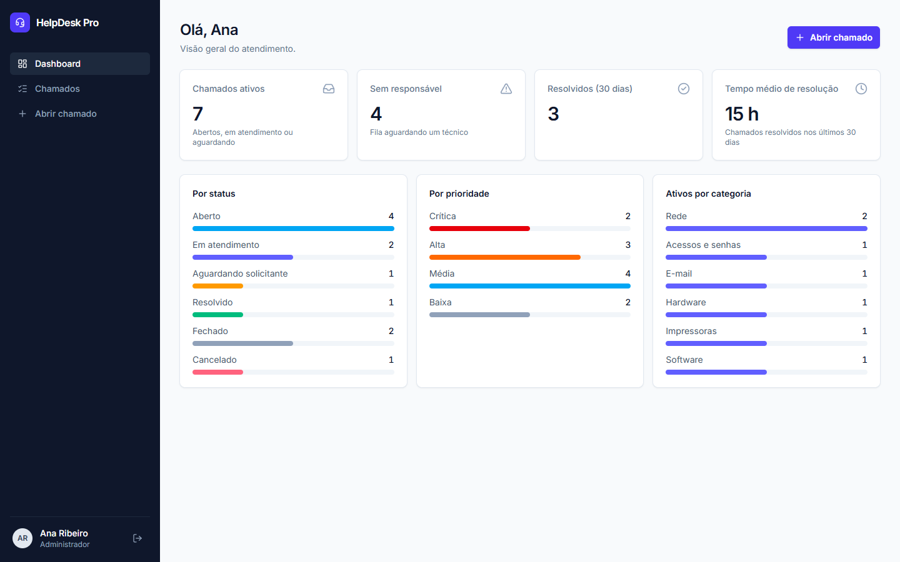
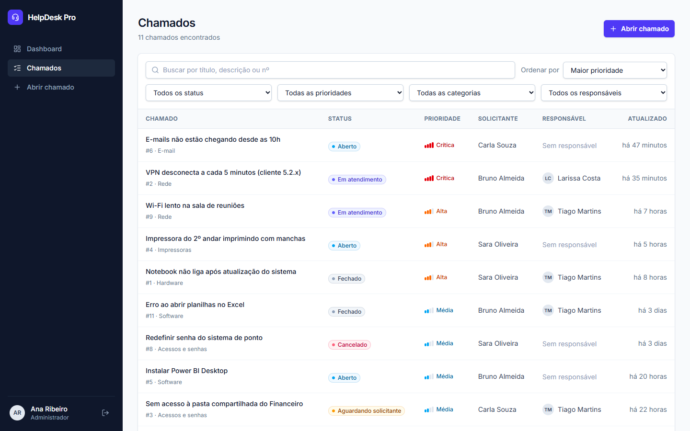
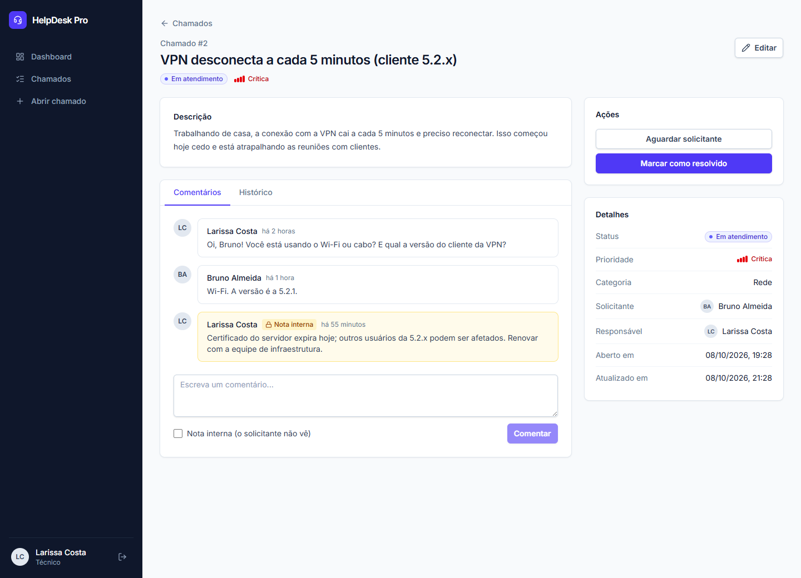
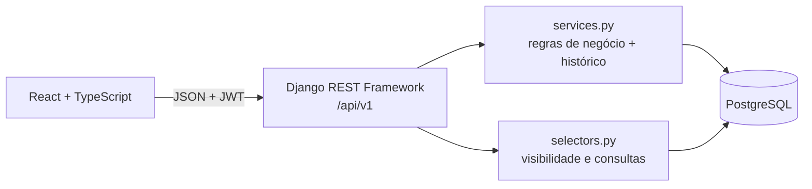

# HelpDesk Pro

Sistema de gestão de chamados de suporte técnico de TI. Projeto de portfólio full stack com
**Django REST Framework**, **React + TypeScript** e **PostgreSQL**, com foco em regras de negócio,
permissões por perfil e segurança.



> 🚧 **Status:** backend e frontend do MVP concluídos e auditados. Próximos passos: CI,
> imagem de produção e deploy ([checklist](docs/AUDITORIA.md#4-checklist-de-qualidade-para-a-primeira-versão-publicável-v10)).

## Funcionalidades

- **Três perfis** com permissões diferentes: solicitante, técnico e administrador
- **Chamados** com categoria, prioridade e um fluxo de status validado no backend
  (Aberto → Em atendimento → Aguardando solicitante → Resolvido → Fechado / Cancelado)
- **Atribuição:** técnicos assumem chamados da fila; administradores distribuem
- **Comentários** com **notas internas** que o solicitante não vê
- **Histórico** imutável de alterações: o quê, de/para, quem e quando
- **Dashboard** com indicadores calculados no banco, conforme o que cada perfil pode ver
- **Busca, filtros, ordenação e paginação**, com o estado guardado na URL
- **Interface responsiva** para desktop e celular
- **API REST documentada** com OpenAPI/Swagger

## Telas

**Lista de chamados:** busca, filtros, ordenação e paginação.



**Detalhe do chamado (visão do técnico):** as ações disponíveis vêm do backend. Notas internas
ficam destacadas e não aparecem para o solicitante.



<table>
  <tr>
    <td width="280"></td>
    <td>
      <strong>No celular</strong><br><br>
      A barra lateral vira um menu, a tabela vira uma lista de cartões e os formulários se
      ajustam à largura da tela.<br><br>
      <em>Prints gerados com dados de demonstração.</em>
    </td>
  </tr>
</table>

## Tecnologias

| Camada | Tecnologias |
|---|---|
| Backend | Python 3.14, Django 5.2, Django REST Framework, SimpleJWT, django-filter, drf-spectacular |
| Banco de dados | PostgreSQL 16 |
| Frontend | React 19, TypeScript, Vite, Tailwind CSS 4, TanStack Query, React Hook Form + Zod |
| Testes | pytest, pytest-django, Vitest, React Testing Library, MSW |
| Ambiente | Docker Compose, Ruff |

## Arquitetura



- **Views** ficam enxutas: autenticam, aplicam a permissão geral e delegam o trabalho.
- **Serializers** validam o formato dos dados e **recusam (400)** campos que o cliente não pode
  alterar, como perfil, status e solicitante.
- **Services** aplicam as regras (transições de status, quem pode editar cada campo) e gravam o
  histórico **na mesma transação** da alteração.
- **Selectors** concentram a regra de visibilidade: o solicitante só enxerga os próprios chamados e
  recebe **404** para os demais.
- O frontend recebe de cada chamado um campo `permissions`, calculado pelas mesmas funções do
  backend. Assim o React mostra só os botões certos sem duplicar regras, e o backend continua
  validando tudo.

## Segurança

- Senhas com hash (PBKDF2) e validação de força
- **Access token** de 15 minutos guardado só em memória. **Refresh token** em cookie `HttpOnly` +
  `SameSite=Strict`, sem uso de `localStorage`
- Rotação e *blacklist* de tokens. A troca de senha encerra as outras sessões
- Limite de tentativas de login, sem confiar em cabeçalhos que o cliente pode falsificar
- API aceita somente JSON (proteção contra CSRF)
- HTTPS, cookies seguros e HSTS ativados em produção (`DEBUG=False`)
- Testes de tentativas de ataque: tokens adulterados ou expirados, `alg: none`, acesso a chamados
  alheios, autopromoção a administrador, força bruta

Os detalhes estão em [docs/AUTENTICACAO.md](docs/AUTENTICACAO.md) e na
[auditoria técnica](docs/AUDITORIA.md).

## Qualidade

| | Backend | Frontend |
|---|---|---|
| Testes | **276** (pytest) | **35** (Vitest + Testing Library) |
| Cobertura | 98% | — |
| Verificação estática | Ruff (lint + formatação) | TypeScript `strict` |

Os testes rodam contra o PostgreSQL real. Eles cobrem a tabela completa de transições de status,
as permissões dos três perfis e a **contagem de consultas ao banco** (para evitar o problema N+1).

## Como rodar

Copie o arquivo de variáveis de ambiente e ajuste se necessário:

```bash
cp .env.example .env
```

### Opção 1: Docker

```bash
docker compose up --build
```

Sobe o PostgreSQL, o backend (http://localhost:8000) e o frontend (http://localhost:5173).
A configuração foi validada com `docker compose config`, mas **ainda não foi executada de verdade**.
Até lá, a opção 2 é a forma testada de rodar o projeto.

### Opção 2: sem Docker (dois terminais)

Requer **Python 3.14**, **PostgreSQL 16** e **Node.js 24**. Crie o usuário e o banco no PostgreSQL:

```sql
CREATE ROLE helpdesk WITH LOGIN PASSWORD 'helpdesk' CREATEDB;
CREATE DATABASE helpdesk OWNER helpdesk;
```

**Backend** (terminal 1, dentro de `backend/`):

```bash
python -m venv .venv
.venv\Scripts\python.exe -m pip install -r requirements-dev.txt
.venv\Scripts\python.exe manage.py migrate
.venv\Scripts\python.exe manage.py createsuperuser
.venv\Scripts\python.exe manage.py runserver
```

**Frontend** (terminal 2, dentro de `frontend/`):

```bash
npm install
npm run dev
```

Acesse **http://localhost:5173** e entre com o usuário criado no `createsuperuser`. O Vite repassa
as chamadas `/api` para o Django (proxy), então os dois precisam estar rodando.

> **Windows/PowerShell:** se aparecer "a execução de scripts foi desabilitada", use `npm.cmd` no
> lugar de `npm` (ex.: `npm.cmd run dev`). No Linux/macOS, troque `.venv\Scripts\python.exe` por
> `.venv/bin/python`.

### Testes

Backend (dentro de `backend/`):

```bash
.venv\Scripts\python.exe -m pytest --cov
```

Frontend (dentro de `frontend/`):

```bash
npm test
```

### Usuários e Django Admin

Novos usuários e categorias podem ser cadastrados pelo Django Admin (http://localhost:8000/admin/)
ou pela API. Veja [como cadastrar usuários de teste](docs/AUTENTICACAO.md#cadastrando-usuários-de-teste).
No admin, **chamados, comentários e histórico são somente leitura**, porque só a API aplica as
regras de negócio e grava o histórico.

## Documentação

| Documento | Conteúdo |
|---|---|
| [Planejamento](docs/PLANEJAMENTO.md) | Requisitos, regras de negócio, modelo de dados (diagrama ER), endpoints e plano de implementação |
| [Autenticação e permissões](docs/AUTENTICACAO.md) | Estratégia JWT, matriz de permissões por perfil, exemplos de requisições |
| [Auditoria técnica](docs/AUDITORIA.md) | Problemas encontrados, correções e checklist para publicação |
| Swagger | http://localhost:8000/api/docs/ (com o backend rodando) |

## Estrutura

```text
helpdesk-pro/
├── backend/            # Django + DRF
│   ├── apps/accounts/  # usuários, perfis, autenticação
│   ├── apps/tickets/   # chamados, categorias, comentários, histórico, dashboard
│   └── apps/core/      # permissões, paginação, health check
├── frontend/           # React + TypeScript + Tailwind
│   └── src/            # api/, auth/, components/, pages/
├── docs/               # planejamento, autenticação, auditoria, prints
└── docker-compose.yml
```
