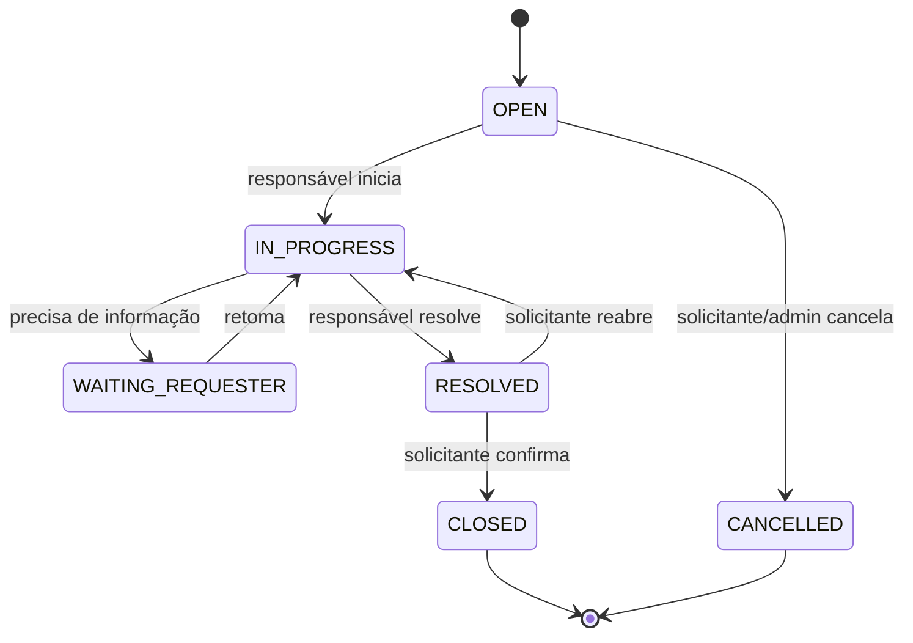
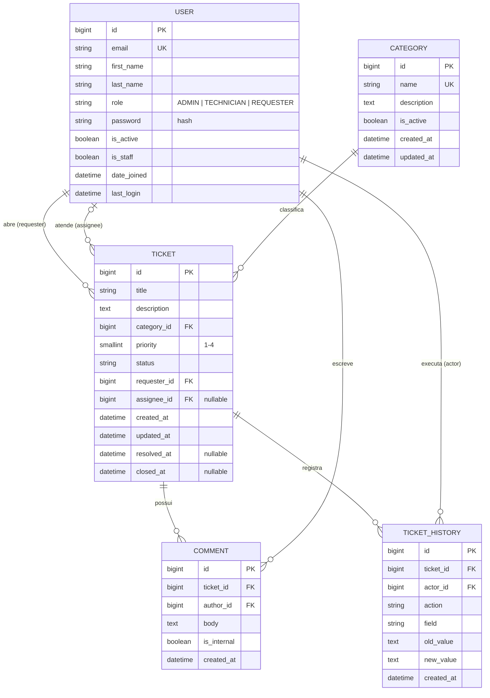
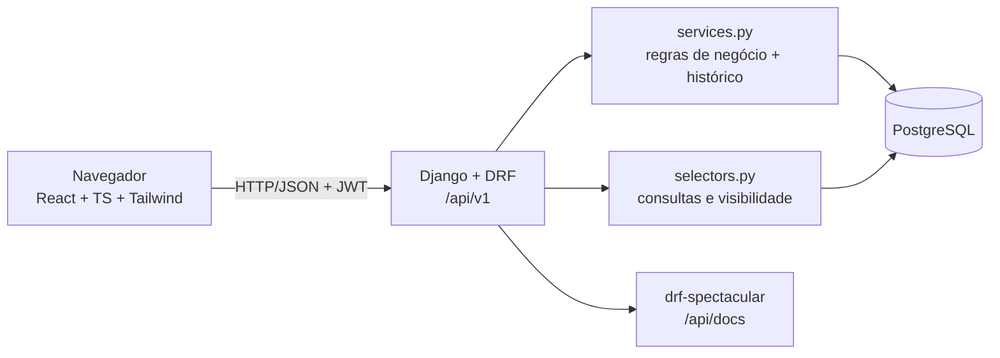

# HelpDesk Pro — Planejamento do MVP

> Status: **planejamento**. Nenhum código da aplicação foi escrito ainda.
> Este documento é a "fonte da verdade" do projeto: ao usar vibe coding, cole a seção relevante no prompt de cada etapa.

---

## 0. Visão geral

O **HelpDesk Pro** é um sistema web para abrir, acompanhar e resolver chamados de suporte de TI.
Três perfis usam o sistema:

| Perfil | Quem é | O que faz, em resumo |
|---|---|---|
| **Solicitante** | Funcionário com um problema | Abre chamados e acompanha os seus |
| **Técnico** | Equipe de suporte | Assume, atende e resolve chamados |
| **Administrador** | Gestor do suporte | Gerencia usuários e categorias, distribui chamados, vê tudo |

### Decisões técnicas principais (e por quê)

| Decisão | Escolha | Por quê (didático) |
|---|---|---|
| Organização do repositório | **Monorepo** (`backend/` + `frontend/` no mesmo repositório) | Um único `git clone` e um único `docker compose up` sobem tudo. Ideal para portfólio. |
| Modelo de usuário | **User customizado** desde o 1º migration, com campo `role` | O Django recomenda criar o User customizado no início; trocar depois é muito trabalhoso. |
| Login | **E-mail + senha** | É o padrão em sistemas corporativos. |
| Autenticação da API | **JWT** com `djangorestframework-simplejwt` | Padrão de mercado para SPA + API, fácil de testar no Swagger. |
| Perfis/permissões | **Um campo `role`** (ADMIN, TECHNICIAN, REQUESTER) em vez de Groups/Permissions do Django | Três perfis fixos → um campo é mais simples de entender, testar e explicar. |
| Prioridade e status | **Choices no código** (enum), não tabelas | São fixos e têm regras atreladas (transições de status). Tabela só faz sentido para dados que o admin edita — por isso **Categoria** é uma tabela. |
| Prioridade como inteiro | `IntegerChoices` (1=Baixa … 4=Crítica) | Ordenar texto daria ordem alfabética ("Alta" < "Baixa" < "Crítica"). Inteiros ordenam corretamente. |
| Regras de negócio | **Camada `services.py`** | As views ficam finas; as regras (e o registro de histórico) ficam num só lugar, testáveis sem HTTP. |
| Histórico | Gravado **explicitamente nos services**, não por *signals* | Signals não sabem qual usuário fez a requisição; o service sabe. Também fica mais fácil de ler. |
| Mudança de status/atribuição | **Endpoints de ação** (`/status/`, `/assign/`) em vez de `PATCH` livre | Centraliza a validação das transições e deixa as permissões claras. |
| Documentação da API | `drf-spectacular` (OpenAPI 3 + Swagger UI) | Gera o schema automaticamente a partir dos serializers. |
| Filtros | `django-filter` + `SearchFilter` + `OrderingFilter` do DRF | Soluções prontas e padrão do ecossistema DRF. |
| Frontend | **Vite + React + TypeScript + Tailwind** | Vite é o padrão atual (rápido, simples). |
| Estado de servidor no front | **TanStack Query** | Cuida de cache, loading e erro das chamadas à API — evita muito código manual. |
| Formulários | **react-hook-form + zod** | Validação tipada e mensagens de erro com pouco código. |
| Testes backend | **pytest + pytest-django + factory_boy** | Fixtures e factories deixam os testes curtos e legíveis. |
| Testes frontend | **Vitest + React Testing Library + MSW** | Vitest integra com Vite; MSW simula a API sem backend real. |
| Gráficos do dashboard | **Cards e barras com Tailwind** no MVP | Evita uma biblioteca de gráficos antes de ser necessária. |

---

## 1. Requisitos

### 1.1 Requisitos funcionais (RF)

**Autenticação e usuários**
- **RF01** — O usuário faz login com e-mail e senha e recebe tokens de acesso.
- **RF02** — O usuário pode fazer logout (o refresh token é invalidado).
- **RF03** — O usuário autenticado consulta seus próprios dados (`/me`).
- **RF04** — O usuário autenticado pode alterar a própria senha informando a senha atual.
- **RF05** — O administrador cadastra, edita, altera o perfil e desativa usuários.
- **RF06** — Não há cadastro público: contas são criadas pelo administrador (ou pelo *seed* de demonstração).

**Categorias**
- **RF07** — O administrador cria, edita e ativa/desativa categorias.
- **RF08** — Todos os usuários autenticados listam as categorias ativas (para abrir chamados).

**Chamados**
- **RF09** — O solicitante abre um chamado com título, descrição, categoria e prioridade.
- **RF10** — Cada perfil lista e consulta os chamados que tem permissão de ver (ver RN).
- **RF11** — Chamados podem ser editados conforme as regras de cada perfil.
- **RF12** — O técnico pode assumir um chamado sem responsável; o administrador pode atribuir/reatribuir a qualquer técnico.
- **RF13** — O status do chamado muda seguindo o fluxo de transições definido.
- **RF14** — Usuários comentam nos chamados; técnicos e admins podem criar **notas internas**, invisíveis ao solicitante.
- **RF15** — Cada chamado tem um histórico das alterações (o quê, valor anterior, novo valor, quem e quando).

**Consulta**
- **RF16** — A listagem de chamados tem busca textual (título, descrição, número).
- **RF17** — Filtros por status, prioridade, categoria, responsável, solicitante, "sem responsável" e intervalo de datas.
- **RF18** — Ordenação por data de criação, data de atualização, prioridade e status.
- **RF19** — Paginação (20 itens por página por padrão).

**Dashboard**
- **RF20** — Dashboard com indicadores: total por status, por prioridade, por categoria, chamados sem responsável, chamados abertos atribuídos a mim e tempo médio de resolução (últimos 30 dias). Os números respeitam a visibilidade do perfil.

**API**
- **RF21** — API REST versionada (`/api/v1/`) documentada em OpenAPI, com Swagger UI.

### 1.2 Requisitos não funcionais (RNF)

**Segurança**
- **RNF01** — Senhas armazenadas apenas como hash (hasher padrão do Django, PBKDF2) e validadas pelos `AUTH_PASSWORD_VALIDATORS` (mínimo 8 caracteres, não comum, não só numérica, não parecida com os dados do usuário).
- **RNF02** — **Toda** permissão é validada no backend. O frontend apenas esconde botões por conveniência.
- **RNF03** — Access token de curta duração (15 min), refresh token de 1 dia, com rotação e *blacklist* no logout.
- **RNF04** — Limite de tentativas no login (throttling do DRF, padrão 10/min por IP, configurável em `LOGIN_THROTTLE_RATE`).
- **RNF05** — Segredos (SECRET_KEY, senha do banco) apenas em variáveis de ambiente; `.env` fora do Git, `.env.example` versionado.
- **RNF06** — Em produção: `DEBUG=False`, `ALLOWED_HOSTS` e `CORS_ALLOWED_ORIGINS` restritos, HTTPS, cookies seguros.
- **RNF07** — Validação de entrada em todos os serializers; ORM do Django (sem SQL manual) previne SQL injection; React escapa HTML por padrão (proibido `dangerouslySetInnerHTML`).
- **RNF08** — Respostas da API nunca retornam o campo de senha. Chamado de outro solicitante retorna **404** (não 403), para não revelar que ele existe.

**Desempenho**
- **RNF09** — Listagens sempre paginadas; consultas usam `select_related`/`prefetch_related` para evitar o problema N+1.
- **RNF10** — Índices no banco para `status`, `priority`, `requester`, `assignee` e `created_at`.

**Qualidade e manutenção**
- **RNF11** — Backend com cobertura de testes ≥ 80%, com foco em regras de negócio e permissões.
- **RNF12** — Lint/format: `ruff` no backend; `eslint` + `prettier` no frontend.
- **RNF13** — CI (GitHub Actions) roda lint, testes e build a cada push.
- **RNF14** — Commits pequenos, um por etapa do plano.

**Usabilidade e portabilidade**
- **RNF15** — Interface em português (pt-BR), responsiva (celular e desktop), com acessibilidade básica (labels em campos, contraste, navegação por teclado).
- **RNF16** — Datas armazenadas em UTC (`USE_TZ=True`) e exibidas no fuso `America/Sao_Paulo`.
- **RNF17** — Todo o ambiente sobe com `docker compose up` (PostgreSQL, backend e frontend).

---

## 2. Regras de negócio (RN)

### 2.1 Visibilidade

| Perfil | Vê quais chamados? |
|---|---|
| Solicitante | **Somente os que ele abriu** |
| Técnico | Todos (precisa ver a fila para assumir chamados) |
| Administrador | Todos |

- **RN01** — A visibilidade é aplicada no *queryset* (`selectors.visible_tickets(user)`), não só na view. Assim, listagem, detalhe, comentários, histórico e dashboard usam **a mesma regra**.
- **RN02** — Ao tentar acessar chamado que não pode ver, a API responde **404**.

### 2.2 Abertura e edição

- **RN03** — Qualquer perfil pode abrir chamado. O `requester` é **sempre** o usuário logado; enviar `requester` (ou qualquer outro campo controlado pelo backend) no corpo da requisição é recusado com 400.
- **RN04** — Chamado novo nasce com status **Aberto** e sem responsável.
- **RN05** — Só categorias **ativas** podem ser escolhidas ao criar ou editar.
- **RN06** — Campos editáveis por perfil:

| Campo | Solicitante (dono) | Técnico | Administrador |
|---|---|---|---|
| título, descrição, categoria | Sim, **só enquanto status = Aberto** | Sim, se for o responsável | Sim |
| prioridade | Só na criação | Sim, se for o responsável | Sim |
| status | Via ações permitidas (RN09) | Via ações permitidas | Via ações permitidas |
| responsável | Não | Só assumir para si (RN07) | Sim |
| solicitante | Nunca | Nunca | Nunca |

### 2.3 Atribuição

- **RN07** — Técnico pode **assumir** um chamado sem responsável (atribuir a si mesmo). Não pode reatribuir chamado que já tem responsável, nem atribuir a outra pessoa.
- **RN08** — Administrador pode atribuir/reatribuir a qualquer **técnico ativo**. O responsável deve ter `role=TECHNICIAN` e `is_active=True`.
- A atribuição usa `select_for_update` dentro de uma transação para evitar que dois técnicos assumam o mesmo chamado ao mesmo tempo.

### 2.4 Fluxo de status

Status: `OPEN` (Aberto), `IN_PROGRESS` (Em atendimento), `WAITING_REQUESTER` (Aguardando solicitante), `RESOLVED` (Resolvido), `CLOSED` (Fechado), `CANCELLED` (Cancelado).

- **RN09** — Transições permitidas (qualquer outra é recusada com 400):

| De → Para | Quem pode | Condição |
|---|---|---|
| OPEN → IN_PROGRESS | Responsável, Admin | Precisa ter responsável |
| OPEN → CANCELLED | Solicitante dono, Admin | — |
| IN_PROGRESS → WAITING_REQUESTER | Responsável, Admin | — |
| IN_PROGRESS → RESOLVED | Responsável, Admin | — |
| WAITING_REQUESTER → IN_PROGRESS | Responsável, Admin | — |
| RESOLVED → CLOSED | Solicitante dono, Admin | Confirma a solução |
| RESOLVED → IN_PROGRESS | Solicitante dono, Admin | "Reabrir": solução não funcionou |



- **RN10** — `resolved_at` é preenchido ao ir para RESOLVED e limpo ao reabrir. `closed_at` é preenchido ao ir para CLOSED ou CANCELLED.
- **RN11** — Chamados **CLOSED** e **CANCELLED** são somente leitura: sem edição, atribuição, mudança de status ou novos comentários (a API responde 403).

### 2.5 Comentários

- **RN12** — Solicitante comenta apenas nos próprios chamados. Técnico e admin comentam em qualquer chamado visível.
- **RN13** — Só técnico/admin podem marcar `is_internal=True`. Notas internas **nunca** aparecem para o solicitante (filtradas no queryset).
- **RN14** — Comentários não podem ser editados nem excluídos no MVP (simplifica e preserva a rastreabilidade).

### 2.6 Histórico

- **RN15** — São registrados: criação do chamado e alterações de título, descrição, categoria, prioridade, status e responsável. Cada registro guarda campo, valor anterior, valor novo, autor (`actor`) e data.
- **RN16** — Os valores são gravados como texto legível no momento da alteração (ex.: nome do técnico), para o histórico continuar correto mesmo que algo mude depois.
- **RN17** — O histórico é **imutável**: não existe endpoint para editar ou apagar. É gravado na mesma transação da alteração (ou ambos salvam, ou nenhum).
- **RN18** — Quem vê o chamado vê o histórico dele.

### 2.7 Usuários e categorias

- **RN19** — Apenas administradores gerenciam usuários e categorias.
- **RN20** — Usuários e categorias **não são excluídos**, apenas desativados (preserva chamados e histórico). Usuário desativado não consegue fazer login.
- **RN21** — O administrador não pode desativar a si mesmo nem remover o próprio perfil de admin (evita ficar sem nenhum admin).
- **RN22** — E-mail de usuário é único (sem diferenciar maiúsculas); nome de categoria é único.

### 2.8 Dashboard

- **RN23** — Os indicadores são calculados sobre `visible_tickets(user)`: o solicitante vê números dos próprios chamados; técnico e admin veem o total.

---

## 3. Modelo de dados

### 3.1 Entidades

**User** (app `accounts`, herda `AbstractUser`)

| Campo | Tipo | Regras |
|---|---|---|
| id | BigAutoField | PK |
| email | EmailField | único, usado no login (`USERNAME_FIELD`) |
| first_name, last_name | CharField(150) | obrigatórios |
| role | CharField choices | `ADMIN` / `TECHNICIAN` / `REQUESTER`; padrão `REQUESTER` |
| password | CharField | **hash** gerado pelo Django — nunca texto puro |
| is_active | Boolean | padrão `True` |
| is_staff | Boolean | acesso ao Django Admin (só para admins) |
| date_joined, last_login | DateTime | automáticos |

> O campo `username` do `AbstractUser` é removido (`username = None`), e um `UserManager` customizado cria usuários pelo e-mail.

**Category** (app `tickets`)

| Campo | Tipo | Regras |
|---|---|---|
| id | BigAutoField | PK |
| name | CharField(80) | único |
| description | TextField | opcional |
| is_active | Boolean | padrão `True` |
| created_at, updated_at | DateTime | automáticos |

**Ticket** (app `tickets`)

| Campo | Tipo | Regras |
|---|---|---|
| id | BigAutoField | PK; exibido como "#123" |
| title | CharField(150) | 5–150 caracteres |
| description | TextField | 10–5000 caracteres |
| category | FK → Category | `on_delete=PROTECT` |
| priority | PositiveSmallInteger choices | 1 Baixa, 2 Média, 3 Alta, 4 Crítica; padrão 2 |
| status | CharField choices | ver RN09; padrão `OPEN` |
| requester | FK → User | `PROTECT`; definido pelo backend |
| assignee | FK → User | nulo; `PROTECT`; só técnico ativo |
| created_at, updated_at | DateTime | automáticos |
| resolved_at, closed_at | DateTime | nulos; ver RN10 |

Índices: `status`, `priority`, `requester`, `assignee`, `created_at`.

**Comment** (app `tickets`)

| Campo | Tipo | Regras |
|---|---|---|
| id | BigAutoField | PK |
| ticket | FK → Ticket | `CASCADE`, `related_name="comments"` |
| author | FK → User | `PROTECT` |
| body | TextField | 1–5000 caracteres |
| is_internal | Boolean | padrão `False`; só técnico/admin |
| created_at | DateTime | automático |

**TicketHistory** (app `tickets`)

| Campo | Tipo | Regras |
|---|---|---|
| id | BigAutoField | PK |
| ticket | FK → Ticket | `CASCADE`, `related_name="history"` |
| actor | FK → User | `PROTECT` |
| action | CharField choices | `CREATED`, `UPDATED`, `STATUS_CHANGED`, `ASSIGNED` |
| field | CharField(50) | nome do campo alterado (vazio em `CREATED`) |
| old_value, new_value | TextField | texto legível, podem ser vazios |
| created_at | DateTime | automático; ordenação padrão |

> **Por que `PROTECT` nos usuários?** Se alguém tentasse apagar um usuário com chamados, o banco recusaria. Combinado com a RN20 (só desativar), nenhum chamado ou histórico fica "órfão".

### 3.2 Diagrama ER



---

## 4. Arquitetura

### 4.1 Visão de componentes



**Fluxo de uma requisição no backend:**
`urls` → `view` (autenticação + permissão de alto nível) → `serializer` (valida formato dos dados) → `service` (aplica regra de negócio, grava em transação, registra histórico) → resposta serializada.

- **View**: "quem pode chamar este endpoint?" e "qual queryset usar?".
- **Serializer**: "os dados têm o formato certo?" (tamanho, tipos, campos obrigatórios).
- **Service**: "esta ação é permitida pelas regras do negócio?" (transições, campos por perfil, histórico).
- **Selector**: "quais registros este usuário pode ver?" e consultas do dashboard.

### 4.2 Estrutura de diretórios planejada

```text
helpdesk-pro/
├── backend/
│   ├── config/                  # projeto Django
│   │   ├── settings.py          # lê variáveis de ambiente (django-environ)
│   │   ├── urls.py
│   │   └── wsgi.py
│   ├── apps/
│   │   ├── core/                # código compartilhado
│   │   │   ├── permissions.py   # IsAdmin, IsTechnicianOrAdmin...
│   │   │   ├── pagination.py
│   │   │   └── views.py         # health check
│   │   ├── accounts/
│   │   │   ├── models.py        # User + UserManager + Role
│   │   │   ├── serializers.py
│   │   │   ├── views.py         # me, change-password, users (admin)
│   │   │   ├── urls.py
│   │   │   ├── admin.py
│   │   │   ├── management/commands/seed_demo.py
│   │   │   └── tests/
│   │   └── tickets/
│   │       ├── models.py        # Category, Ticket, Comment, TicketHistory
│   │       ├── serializers.py
│   │       ├── services.py      # create/update/assign/change_status/add_comment
│   │       ├── selectors.py     # visible_tickets, dashboard_summary
│   │       ├── filters.py       # django-filter
│   │       ├── views.py
│   │       ├── urls.py
│   │       ├── admin.py
│   │       └── tests/
│   │           ├── factories.py
│   │           ├── test_services.py
│   │           ├── test_permissions.py
│   │           └── test_api_*.py
│   ├── conftest.py              # fixtures globais do pytest
│   ├── pyproject.toml           # config pytest, ruff, coverage
│   ├── requirements.txt
│   ├── requirements-dev.txt
│   ├── manage.py
│   └── Dockerfile
├── frontend/
│   ├── src/
│   │   ├── api/                 # cliente axios + funções por recurso
│   │   ├── auth/                # AuthContext, ProtectedRoute, RoleGate
│   │   ├── components/          # botões, tabela, paginação, badges...
│   │   ├── pages/               # Login, Dashboard, Tickets, TicketDetail, Admin...
│   │   ├── hooks/               # hooks do TanStack Query
│   │   ├── types/               # tipos TypeScript da API
│   │   ├── lib/                 # utilitários (formatação de datas, labels)
│   │   ├── test/                # setup do Vitest + handlers do MSW
│   │   ├── App.tsx
│   │   └── main.tsx
│   ├── index.html
│   ├── package.json
│   ├── tsconfig.json
│   ├── vite.config.ts
│   └── Dockerfile
├── docs/
│   └── PLANEJAMENTO.md          # este documento
├── .github/workflows/ci.yml
├── docker-compose.yml
├── .env.example
├── .gitignore
└── README.md
```

> **Por que só 3 apps Django?** Cada app deve representar um assunto. Categoria, comentário e histórico só existem em função do chamado, então ficam em `tickets`. Menos apps = menos importações cruzadas para entender.

### 4.3 Autenticação no frontend

- Login retorna `access` e `refresh`.
- O `access` fica **em memória** (variável no AuthContext); o `refresh` fica no `localStorage` para manter a sessão após recarregar a página.
- Um *interceptor* do axios: ao receber 401, tenta `/auth/token/refresh/` uma vez; se falhar, faz logout.
- **Trade-off honesto:** `localStorage` pode ser lido por um script malicioso (XSS). Mitigamos com React (que escapa HTML), sem `dangerouslySetInnerHTML` e com tokens de vida curta. Uma melhoria pós-MVP é guardar o refresh em cookie `HttpOnly`.

---

## 5. Endpoints REST planejados

Base: `/api/v1/`. Todos exigem autenticação, exceto login, refresh, health e docs.
Legenda de perfis: **A** = Admin, **T** = Técnico, **S** = Solicitante.

### Autenticação e conta
| Método | Rota | Perfis | Descrição |
|---|---|---|---|
| POST | `/auth/token/` | público | Login (e-mail, senha) → `access`, `refresh` |
| POST | `/auth/token/refresh/` | público | Novo `access` a partir do `refresh` |
| POST | `/auth/logout/` | A T S | Coloca o `refresh` na blacklist |
| GET | `/auth/me/` | A T S | Dados do usuário logado |
| POST | `/auth/me/change-password/` | A T S | Troca de senha (exige senha atual) |

### Usuários
| Método | Rota | Perfis | Descrição |
|---|---|---|---|
| GET | `/users/` | A | Lista (filtros: `role`, `is_active`; busca: nome, e-mail) |
| POST | `/users/` | A | Cria usuário (senha com hash) |
| GET | `/users/{id}/` | A | Detalhe |
| PATCH | `/users/{id}/` | A | Edita nome, perfil, `is_active` (RN21) |
| GET | `/users/technicians/` | A T | Técnicos ativos (para atribuição) |

### Categorias
| Método | Rota | Perfis | Descrição |
|---|---|---|---|
| GET | `/categories/` | A T S | S e T veem só ativas; A vê todas |
| POST | `/categories/` | A | Cria |
| GET | `/categories/{id}/` | A T S | Detalhe |
| PATCH | `/categories/{id}/` | A | Edita / ativa / desativa |

### Chamados
| Método | Rota | Perfis | Descrição |
|---|---|---|---|
| GET | `/tickets/` | A T S | Lista visível ao perfil (ver parâmetros abaixo) |
| POST | `/tickets/` | A T S | Abre chamado |
| GET | `/tickets/{id}/` | A T S | Detalhe (404 se não visível) |
| PATCH | `/tickets/{id}/` | A T S | Edita campos conforme RN06 |
| POST | `/tickets/{id}/assign/` | A T | `{ "assignee_id": 5 }` — T só pode usar o próprio id (RN07) |
| POST | `/tickets/{id}/status/` | A T S | `{ "status": "RESOLVED" }` — valida RN09 |
| GET | `/tickets/{id}/comments/` | A T S | Lista (sem internas para S) |
| POST | `/tickets/{id}/comments/` | A T S | `{ "body": "...", "is_internal": false }` |
| GET | `/tickets/{id}/history/` | A T S | Histórico do chamado |

Parâmetros de `GET /tickets/`:
- Filtros: `status`, `priority`, `category`, `assignee`, `requester`, `unassigned=true`, `created_after`, `created_before` (múltiplos valores: `status=OPEN&status=IN_PROGRESS`)
- Busca: `search=impressora` (título, descrição; número se for inteiro)
- Ordenação: `ordering=-created_at` (`created_at`, `updated_at`, `priority`, `status`)
- Paginação: `page=2`, `page_size=20` (máx. 100)

### Dashboard, saúde e documentação
| Método | Rota | Perfis | Descrição |
|---|---|---|---|
| GET | `/dashboard/summary/` | A T S | Indicadores (RN23) |
| GET | `/api/health/` | público | Verifica API e banco (usado pelo Docker/deploy) |
| GET | `/api/schema/` | público* | Schema OpenAPI |
| GET | `/api/docs/` | público* | Swagger UI |

\* Em produção, pode-se restringir a docs a usuários autenticados.

### Códigos de resposta padronizados
`200` OK · `201` criado · `204` sem conteúdo · `400` dados inválidos ou transição proibida · `401` não autenticado · `403` autenticado mas sem permissão · `404` não existe **ou não é visível** · `429` excesso de tentativas.

---

## 6. Plano de implementação

Regras para cada etapa (vibe coding com segurança):
1. **Uma etapa por vez.** Peça à IA apenas a etapa atual e cole as regras relevantes deste documento.
2. **Leia o diff** antes de aceitar. Pergunte "por quê?" sobre o que não entender.
3. **Rode os testes** e verifique os critérios de aceitação.
4. **Um commit por etapa**, com mensagem descritiva (ex.: `feat(tickets): add status transitions`).

### Fase A — Fundação

**Etapa 0 — Repositório**
- `git init` dentro de `helpdesk-pro/`, `.gitignore` (Python, Node, `.env`), `README.md` inicial, este documento em `docs/`.
- ✅ Aceite: `git status` dentro da pasta mostra só arquivos do projeto; `.env` está ignorado.

**Etapa 1 — Backend + PostgreSQL no Docker**
- Projeto Django em `backend/`, settings via variáveis de ambiente, `docker-compose.yml` com `db` (postgres:16) e `backend`, endpoint `/api/health/`, pytest + ruff configurados.
- ✅ Aceite: `docker compose up` sobe tudo; `GET /api/health/` → 200 com `{"status": "ok", "database": "ok"}`.
- 🧪 Testes: health retorna 200; pytest roda dentro do container.

**Etapa 2 — Usuário customizado, modelos iniciais e Django Admin** ✅ concluída
- Apps `accounts` e `tickets`; model `User` (e-mail como login, `role`) e `UserManager`; models `Category`, `Ticket`, `Comment` e `TicketHistory` (só estrutura, sem regras de negócio); migrations iniciais; Django Admin (histórico somente leitura).
- ✅ Aceite: `createsuperuser` pede e-mail; superuser nasce com `role=ADMIN`; não existe tabela `auth_user`; `makemigrations --check` sem pendências; páginas do admin carregam.
- 🧪 Testes: senha salva com hash (`check_password` ok, campo ≠ texto puro); role padrão `REQUESTER`; e-mail único sem diferenciar maiúsculas; e-mail obrigatório; defaults do chamado; ordenação por prioridade; `PROTECT` em categoria/usuário; banco é PostgreSQL.
- Obs.: o comando `seed_demo` (dados de demonstração) foi adiado para a Etapa 11, quando o domínio estiver completo.

**Etapa 3 — Autenticação JWT + Swagger** ✅ concluída
- SimpleJWT (login, refresh, logout com blacklist), `/auth/me/`, troca de senha, throttling no login, drf-spectacular em `/api/docs/`.
- ✅ Aceite: é possível fazer login e chamar `/me` pelo Swagger (botão *Authorize*).
- 🧪 Testes: login correto → 200 com tokens; senha errada → 401; usuário inativo → 401; `/me` sem token → 401; `/me` não contém `password`; refresh após logout → 401; troca de senha exige senha atual e valida força.

**Etapa 4 — Gestão de usuários (admin)** ✅ concluída (`/users/technicians/` entregue na Etapa 8)
- Permissões em `core/permissions.py`; `UserViewSet` (sem DELETE).
- ✅ Aceite: admin gerencia usuários pela API; demais perfis recebem 403.
- 🧪 Testes: S e T → 403 em `/users/`; admin cria usuário e a senha fica com hash; senha fraca → 400; admin não desativa a si mesmo nem remove o próprio role (RN21); `/technicians/` só traz técnicos ativos; S → 403 em `/technicians/`.

### Fase B — Núcleo do domínio (backend)

**Etapa 5 — Categorias**
- Serializer e viewset (model e admin já criados na Etapa 2).
- ✅ Aceite: CRUD sem DELETE funcionando para admin.
- 🧪 Testes: só admin cria/edita (S/T → 403); S/T não veem inativas; nome duplicado → 400.

**Etapa 6 — Chamados: criar, listar, detalhar** ✅ concluída junto com a Etapa 3 (permissões de chamados)
- `selectors.visible_tickets` (models já criados na Etapa 2); `services.create_ticket` (grava histórico `CREATED`); factories.
- ✅ Aceite: cada perfil lista apenas o que pode ver.
- 🧪 Testes: S vê só os seus; S acessando chamado alheio → **404**; `requester` enviado no corpo → 400; status inicial `OPEN` e sem responsável; categoria inativa → 400; validação de tamanho de título/descrição; T e A veem todos; criação gera 1 registro de histórico.

**Etapa 7 — Edição com permissão por campo + histórico** ✅ concluída junto com a Etapa 3
- `services.update_ticket` aplicando RN06 e gravando um histórico por campo alterado.
- ✅ Aceite: PATCH respeita a tabela RN06.
- 🧪 Testes: S edita título com status OPEN → ok; S edita com IN_PROGRESS → 403; S altera prioridade após criação → 403; T não responsável → 403; A edita tudo; enviar o mesmo valor não gera histórico; histórico guarda valores antigo/novo e o `actor`.

**Etapa 8 — Atribuição e transições de status** ✅ concluída
- `services.assign_ticket` (com `select_for_update`) e `services.change_status` com a tabela RN09 como dicionário no código.
- ✅ Aceite: todas as transições da tabela funcionam e todas as outras são recusadas.
- 🧪 Testes (use `pytest.mark.parametrize` para cobrir a tabela inteira): T assume chamado sem responsável → ok; T reatribui chamado de outro → 403; T atribui a outro técnico → 403; A atribui a solicitante → 400; A atribui a técnico inativo → 400; OPEN→IN_PROGRESS sem responsável → 400; S cancela o próprio OPEN → ok; S resolve → 403; `resolved_at`/`closed_at` corretos; CLOSED/CANCELLED não aceitam nada (RN11); cada mudança gera histórico.

**Etapa 9 — Comentários** ✅ concluída (junto com o endpoint de histórico)
- `services.add_comment` e endpoints aninhados (model já criado na Etapa 2).
- ✅ Aceite: conversa no chamado funcionando com notas internas.
- 🧪 Testes: S comenta no próprio → 201; S comenta em alheio → 404; S envia `is_internal=true` → 403 (ou 400); S não vê notas internas na listagem; T/A veem todas; comentar em CLOSED → 400; corpo vazio → 400.

**Etapa 10 — Busca, filtros, ordenação, paginação** ✅ concluída
- `filters.py` com django-filter; SearchFilter; OrderingFilter; paginação global.
- ✅ Aceite: combinações de filtros funcionam juntas e **continuam respeitando a visibilidade**.
- 🧪 Testes: cada filtro isolado; `unassigned=true`; busca por texto e por número; ordenação por prioridade (Crítica primeiro com `-priority`); `page_size` > 100 é limitado; S filtrando por `requester` de outro usuário → lista vazia.

**Etapa 11 — Dashboard**
- `selectors.dashboard_summary(user)` com agregações (`Count`, `Avg`).
- Comando `seed_demo` (1 admin, 2 técnicos, 2 solicitantes, categorias e alguns chamados), idempotente e executado só manualmente — dados de demonstração, nunca em produção.
- ✅ Aceite: um endpoint retorna todos os indicadores do RF20.
- 🧪 Testes: contagens corretas com dados conhecidos; S só conta os próprios (RN23); tempo médio ignora não resolvidos; banco vazio não quebra (retorna zeros/`null`).

> 🏁 **Checkpoint: backend do MVP completo.** Revisar o Swagger, rodar cobertura (meta ≥ 80%), fazer uma tag `v0.1.0-api`.

### Fase C — Frontend

**Etapa 12 — Esqueleto do frontend**
- Vite + React + TS + Tailwind + React Router + TanStack Query + Vitest + RTL + MSW; serviço `frontend` no Compose; layout base (menu lateral, cabeçalho).
- ✅ Aceite: `docker compose up` abre o front em `http://localhost:5173`; `npm test` e `npm run build` passam.
- 🧪 Testes: App renderiza; rota inexistente mostra página 404.

**Etapa 13 — Login e sessão**
- Página de login, AuthContext, cliente axios com interceptor de refresh, `ProtectedRoute`, logout, tipos da API.
- ✅ Aceite: login leva ao dashboard; recarregar a página mantém a sessão; logout volta ao login.
- 🧪 Testes (MSW): credenciais erradas exibem mensagem; rota protegida sem login redireciona; 401 dispara refresh e repete a requisição; falha no refresh faz logout.

**Etapa 14 — Lista de chamados**
- Tabela com badges de status/prioridade, busca, filtros, ordenação e paginação **guardados na URL** (dá para compartilhar o link de uma busca).
- ✅ Aceite: tudo que a API suporta na Etapa 10 é acessível pela tela; estados de carregando, vazio e erro.
- 🧪 Testes: mudar filtro altera a query enviada; paginação navega; lista vazia mostra mensagem.

**Etapa 15 — Abrir e editar chamado**
- Formulário com react-hook-form + zod (mesmas regras de tamanho do backend); exibe erros vindos da API.
- ✅ Aceite: solicitante abre chamado e é redirecionado ao detalhe.
- 🧪 Testes: validação no cliente; erro 400 da API aparece no campo certo; só categorias ativas no select.

**Etapa 16 — Detalhe do chamado**
- Dados, botões de ação conforme perfil/status (espelhando RN09), atribuição, comentários (com nota interna para T/A) e linha do tempo do histórico.
- ✅ Aceite: o fluxo completo (abrir → assumir → resolver → fechar) pode ser feito pela interface com os usuários do seed.
- 🧪 Testes: S não vê botão "Resolver" nem checkbox "nota interna"; T vê "Assumir" só se não houver responsável; ação bem-sucedida atualiza a tela.

**Etapa 17 — Dashboard**
- Cards de indicadores e barras simples com Tailwind.
- ✅ Aceite: números batem com o endpoint; layout responsivo.
- 🧪 Testes: renderiza valores do mock; estado vazio.

**Etapa 18 — Telas administrativas**
- Usuários (listar, criar, editar perfil, ativar/desativar) e categorias. Rotas acessíveis só para admin.
- ✅ Aceite: admin gerencia tudo pela interface; outros perfis acessando a URL veem "acesso negado" (e a API também recusa).
- 🧪 Testes: rota admin bloqueada para S/T; formulário de criação de usuário valida senha.

### Fase D — Qualidade e entrega

**Etapa 19 — CI**
- GitHub Actions: ruff + pytest (com PostgreSQL como *service*) + cobertura; eslint + vitest + build do front.
- ✅ Aceite: badge verde no README; PR com teste falhando fica vermelho.

**Etapa 20 — Produção e deploy**
- Dockerfiles de produção (gunicorn; front compilado servido por nginx), settings de produção (RNF06), `collectstatic`, migrations no start, deploy em uma plataforma com PostgreSQL gerenciado (escolha na hora: Render, Railway ou Fly.io).
- ✅ Aceite: aplicação acessível por HTTPS com usuários de demonstração; `DEBUG=False`; `manage.py check --deploy` sem alertas críticos.

**Etapa 21 — README de portfólio**
- Descrição, prints, diagrama, como rodar localmente, credenciais de demonstração, decisões técnicas (resumo da seção 0), link do deploy e do Swagger.

---

## 7. Fora do escopo do MVP (para depois)

Anexos, notificações por e-mail, SLA com prazos, autoatendimento/base de conhecimento, cadastro público, edição de comentários, refresh token em cookie HttpOnly, testes E2E (Playwright), relatórios exportáveis, multi-idioma.
